# Janus: Decoupling Visual Encoding for Unified Multimodal Understanding and Generation (통합된 다중모달 이해 및 생성을 위한 시각적 인코딩 분리)

**저자:** Chengyue Wu, Xiaokang Chen, Zhiyu Wu, Yiyang Ma, Xingchao Liu, Zizheng Pan, Wen Liu, Zhenda Xie, Xingkai Yu, Chong Ruan, Ping Luo
**소속:** DeepSeek-AI, 홍콩대학교, 북경대학교
**프로젝트 페이지:** https://github.com/deepseek-ai/Janus

## 초록 (Abstract)
이 논문에서는 다중모달 이해(multimodal understanding)와 생성(generation)을 통합하는 자기회귀(autoregressive) 프레임워크인 Janus를 소개합니다. 카멜레온(Chameleon)과 같은 이전 연구들은 종종 두 작업 모두에 단일 시각 인코더(visual encoder)를 의존했습니다. 그러나 다중모달 이해와 생성에서 요구되는 정보의 세부성(granularity) 수준이 다르기 때문에, 이러한 접근 방식은 특히 다중모달 이해 부분에서 최적이 아닌 성능을 초래할 수 있습니다. 이 문제를 해결하기 위해, 우리는 처리를 위해 단일화된 트랜스포머 아키텍처를 여전히 활용하면서도 시각적 인코딩을 별도의 경로로 분리(decoupling)합니다. 이 분리는 시각 인코더가 이해와 생성에서 맡는 역할 간의 충돌을 완화할 뿐만 아니라 프레임워크의 유연성을 향상시킵니다. 예를 들어, 다중모달 이해 및 생성 구성 요소 모두 독립적으로 가장 적합한 인코딩 방법을 선택할 수 있습니다. 실험 결과에 따르면 Janus는 이전의 통합 모델을 능가하며, 작업별(task-specific) 전용 모델의 성능과 대등하거나 그 이상을 달성했습니다. Janus의 단순성, 높은 유연성 및 효과는 차세대 통합 다중모달 모델의 강력한 후보임을 보여줍니다.

## 1. 서론 (Introduction)
최근 몇 년 동안 다중모달 대형 모델은 이해 및 생성 영역 모두에서 상당한 발전을 이루었습니다. 다중모달 이해 분야에서 연구자들은 대형 언어 모델(LLM)이 이미지를 이해할 수 있도록 시각 인코더를 가교로 사용하는 LLaVA의 설계를 따릅니다. 시각 생성 분야에서는 확산(diffusion) 기반 접근 방식이 눈에 띄는 성공을 거두었습니다. 최근에는 시각 생성을 위한 자기회귀 방법을 탐구하여 확산 모델에 필적하는 성능을 달성한 연구도 있습니다. 보다 강력하고 범용적인 다중모달 모델을 구축하기 위해 연구자들은 다중모달 이해 및 생성 작업을 결합하려고 시도했습니다. 예를 들어, 일부 연구에서는 다중모달 이해 모델을 사전 학습된 확산 모델과 연결하려고 시도했습니다. Emu는 LLM의 출력을 사전 학습된 확산 모델의 조건으로 사용한 다음, 확산 모델에 의존하여 이미지를 생성합니다. 그러나 엄밀히 말해 이 접근 방식은 진정한 통합 모델로 간주될 수 없는데, 시각 생성 기능은 외부 확산 모델에 의해 처리되는 반면 다중모달 LLM 자체는 이미지를 직접 생성할 능력이 부족하기 때문입니다.

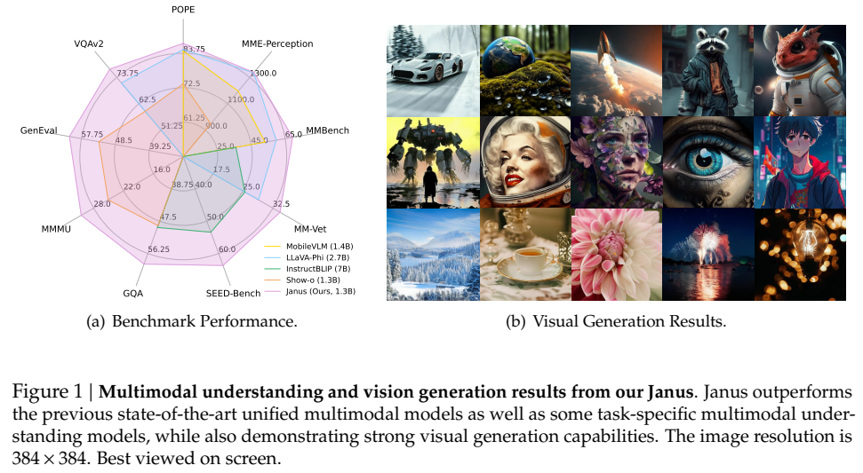
**Figure 1 | Janus의 다중모달 이해 및 시각 생성 결과.** Janus는 기존의 최고 성능을 자랑하는 통합 다중모달 모델뿐만 아니라 일부 작업 전용 다중모달 이해 모델을 능가하는 동시에 강력한 시각 생성 능력을 보여줍니다.

다른 접근 방식은 단일 트랜스포머를 사용하여 다중모달 이해 및 생성 작업을 모두 통합하며, 이는 시각 생성에 대한 지시 따르기(instruction-following)를 개선하고 잠재적인 창발적 능력(emergent abilities)을 잠금 해제하며 모델의 중복성을 줄입니다. 이러한 방법들은 일반적으로 두 작업의 입력을 처리하기 위해 단일 시각 인코더를 사용합니다. 그러나 다중모달 이해 및 생성 작업에 필요한 표현(representation)은 크게 다릅니다. 다중모달 이해 작업에서 시각 인코더의 목적은 고급 의미 정보(예: 이미지 내의 객체 범주 또는 시각적 속성)를 추출하는 것입니다. 이해 작업의 출력은 이미지에서 정보를 추출하는 것뿐만 아니라 복잡한 의미 추론을 포함합니다. 따라서 시각 인코더 표현의 세부성은 주로 고차원적인 의미 표현에 집중하는 경향이 있습니다. 대조적으로 시각 생성 작업에서는 주로 지역적 세부 사항을 생성하고 이미지의 전역적 일관성을 유지하는 데 중점을 둡니다. 이 맥락에서의 표현은 세분화된 공간 구조 및 텍스처 세부 표현이 가능한 저차원 인코딩을 필요로 합니다. 이 두 작업의 표현을 동일한 공간 내에서 통합하면 충돌과 상충 관계(trade-offs)가 발생합니다. 결과적으로 다중모달 이해 및 생성을 위한 기존의 통합 모델들은 종종 다중모달 이해 성능을 타협하게 되어 최신 다중모달 이해 모델에 크게 뒤처집니다. 우리는 절제 연구(ablation study)에서 이 문제를 더 깊이 탐구합니다.

이 문제를 해결하기 위해 우리는 다중모달 이해와 생성을 위한 시각적 인코딩을 분리하는 통합 다중모달 프레임워크인 Janus를 제안합니다. 구체적으로, 우리는 두 가지 독립적인 시각 인코딩 경로를 도입합니다. 하나는 다중모달 이해를 위한 것이고 다른 하나는 다중모달 생성을 위한 것으로, 이 둘은 동일한 트랜스포머 아키텍처에 의해 통합됩니다. 제안된 방법은 두 가지 주요 이점을 제공합니다. (1) Janus는 다중모달 이해와 생성의 서로 다른 세부적 필요성에서 비롯되는 충돌을 완화하고, 시각 인코더를 선택할 때 두 작업 사이에서 타협할 필요를 없앱니다. (2) Janus는 유연하고 확장 가능합니다. 분리 후, 이해 및 생성 작업 모두 해당 도메인에 특화된 최신 인코딩 기술을 채택할 수 있습니다. 게다가 향후 독립적인 인코더가 특징을 추출한 후 단일화된 트랜스포머를 사용하여 이를 처리할 수 있는 점 클라우드, 뇌파(EEG) 신호 또는 오디오 데이터와 같은 추가 입력 유형을 수용할 가능성도 있습니다.

우리가 아는 한, 우리는 통합 다중모달 이해 및 생성 프레임워크 내에서 시각적 인코딩 분리의 중요성을 처음으로 강조합니다. 우리의 실험 결과에 따르면 Janus는 다중모달 이해 및 생성 벤치마크 모두에서 비슷한 매개변수 크기를 가진 기존 통합 모델을 능가하여 최고 수준(state-of-the-art)의 결과를 달성했습니다. 특히 Janus는 매개변수가 훨씬 더 많은 일부 작업 전용 모델을 능가하기도 합니다(Figure 1). 구체적으로 다중모달 이해 벤치마크 MMBench, SEED-Bench, POPE에서 Janus (1.3B)는 각각 69.4, 63.7, 87.0의 점수를 기록하여 LLaVA-v1.5 (7B)와 Qwen-VL-Chat (7B)를 능가했습니다. 시각 생성 벤치마크 MSCOCO-30K 및 GenEval에서 Janus는 8.53의 FID 점수와 61%의 정확도를 달성하여 DALL-E 2 및 SDXL과 같은 텍스트-이미지 생성 모델을 능가했습니다. 우리는 강력한 성능과 Janus의 높은 유연성 및 확장성이 차세대 통합 다중모달 모델을 위한 강력한 후보가 된다고 믿습니다.

## 2. 관련 연구 (Related Work)

### 2.1. 시각 생성 (Visual Generation)
시각 생성은 자연어 처리의 개념과 트랜스포머 아키텍처의 발전을 결합한 빠르게 발전하는 분야입니다. 언어 처리에서의 성공에 영향을 받은 자기회귀 모델은 트랜스포머를 활용하여 이산 시각 토큰(코드북 ID)의 시퀀스를 예측합니다. 이러한 모델들은 시각적 데이터를 토큰화하고 GPT 스타일 기술과 유사한 예측 방식을 사용합니다. 또한, 마스킹된 예측 모델은 BERT 스타일 마스킹 방법을 활용하여 시각적 입력의 마스킹된 부분을 예측함으로써 합성 효율성을 향상시키며 비디오 생성에도 채택되었습니다. 이와 동시에 연속 확산(continuous diffusion) 모델은 시각 생성에서 인상적인 능력을 보여주었으며, 확률론적 렌즈를 통해 생성에 접근함으로써 이산적 방법을 보완합니다.

### 2.2. 다중모달 이해 (Multimodal Understanding)
다중모달 대형 언어 모델(MLLM)은 텍스트와 이미지를 모두 통합합니다. 사전 학습된 LLM을 활용함으로써 MLLM은 다중모달 정보를 이해하고 처리하는 강력한 능력을 보여줍니다. 최근의 발전은 이미지 생성을 용이하게 하기 위해 사전 학습된 확산 모델로 MLLM을 확장하는 것을 탐구했습니다. 이러한 방법은 도구 활용 범주에 속하며, 여기서 확산 모델은 MLLM이 출력한 조건에 기반하여 이미지를 생성하는 데 사용되고 MLLM 자체는 직접 시각적 생성을 수행하는 능력이 없습니다. 게다가 전체 시스템의 생성 능력은 종종 외부 확산 모델에 의해 제한되어, 성능이 확산 모델을 독자적으로 사용하는 것보다 열등한 경우가 많습니다.

### 2.3. 통합 다중모달 이해 및 생성 (Unified Multimodal Understanding and Generation)
통합 다중모달 이해 및 생성 모델은 서로 다른 모달리티 간에 원활한 추론 및 생성을 촉진하는 강력한 수단으로 간주됩니다. 이러한 모델의 전통적인 접근 방식은 자기회귀(AR) 모델을 기반으로 하든 확산 모델을 기반으로 하든 관계없이 이해 및 생성 작업 모두에 단일 시각 표현을 사용합니다. 예를 들어 Chameleon은 다중모달 이해 및 생성 모두에서 이미지를 인코딩하기 위해 VQ Tokenizer를 채택합니다. 그러나 시각 인코더가 이해와 생성의 요구 사항 사이에서 타협에 직면할 수 있기 때문에 이 관행은 최적이 아닌 결과를 초래할 수 있습니다. 반면 우리의 Janus는 이해 및 생성을 위한 시각적 표현을 명시적으로 분리하여 다양한 작업이 각기 다른 수준의 정보를 필요로 할 수 있음을 인식합니다.

## 3. Janus: 단순하고 통합적이며 유연한 다중모달 프레임워크 (Janus: A Simple, Unified and Flexible Multimodal Framework)

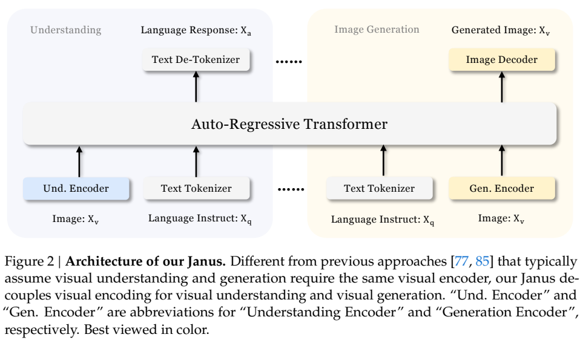
**Figure 2 | Janus의 아키텍처.** 시각적 이해와 생성에 동일한 시각 인코더가 필요하다고 가정하는 이전의 접근 방식들과 달리, 우리의 Janus는 시각적 이해와 시각 생성을 위한 시각적 인코딩을 분리합니다.

### 3.1. 아키텍처 (Architecture)
Janus의 아키텍처는 Figure 2에 나와 있습니다. 순수 텍스트 이해, 다중모달 이해 및 시각 생성을 위해 우리는 원시 입력을 특성(features)으로 변환하는 독립적인 인코딩 방법을 적용하며, 이들은 통합된 자기회귀 트랜스포머에 의해 처리됩니다.
구체적으로, 텍스트 이해의 경우 LLM의 내장 토크나이저를 사용하여 텍스트를 이산 ID로 변환하고 각 ID에 해당하는 특성 표현을 얻습니다. 다중모달 이해의 경우 SigLIP 인코더를 사용하여 이미지에서 고차원 의미 특성을 추출합니다. 이러한 특성은 2D 그리드에서 1D 시퀀스로 평탄화(flattened)되며, 이해 어댑터(understanding adaptor)가 이 이미지 특성들을 LLM의 입력 공간으로 매핑하는 데 사용됩니다. 시각 생성 작업의 경우 VQ 토크나이저를 사용하여 이미지를 이산 ID로 변환합니다. ID 시퀀스가 1D로 평탄화된 후, 생성 어댑터(generation adaptor)를 사용하여 각 ID에 해당하는 코드북 임베딩을 LLM의 입력 공간으로 매핑합니다. 그런 다음 이러한 특성 시퀀스들을 연결(concatenate)하여 다중모달 특성 시퀀스를 형성하고, 이는 후속 처리를 위해 LLM에 입력됩니다. 순수 텍스트 이해 및 다중모달 이해 작업 모두에서 텍스트 예측을 위해 LLM의 내장 예측 헤드(prediction head)가 활용되며, 시각 생성 작업에서 이미지 예측을 위해 무작위로 초기화된 예측 헤드가 사용됩니다. 전체 모델은 특별히 설계된 어텐션 마스크 없이도 자기회귀 프레임워크를 준수합니다.

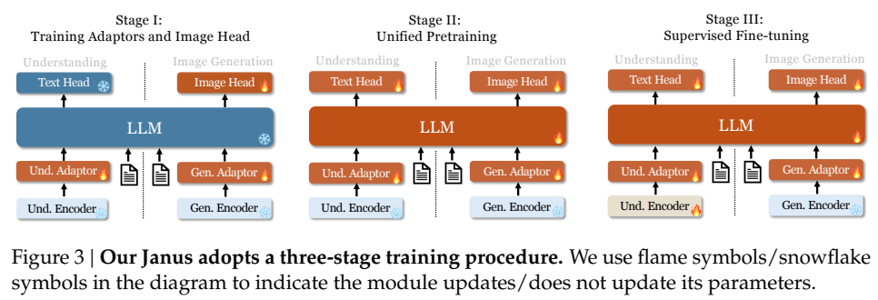
**Figure 3 | 우리의 Janus는 세 단계의 훈련 과정을 채택합니다.** 불꽃/눈송이 기호는 모듈이 매개변수를 업데이트하는지/하지 않는지를 나타냅니다.

### 3.2. 훈련 절차 (Training Procedure)
Janus의 훈련은 Figure 3에 나와 있듯이 세 단계로 나뉩니다.
**1단계: 어댑터 및 이미지 헤드 훈련 (Stage I).** 이 단계의 주요 목표는 임베딩 공간 내에서 시각적 요소와 언어적 요소 간의 개념적 연결을 만들어 LLM이 이미지에 표시된 개체를 이해하고 예비적인 시각 생성 능력을 갖출 수 있도록 하는 것입니다. 이 단계 동안 시각 인코더와 LLM은 동결(frozen) 상태로 유지되며 이해 어댑터, 생성 어댑터 및 이미지 헤드 내의 훈련 가능한 매개변수만 업데이트됩니다.
**2단계: 통합 사전 훈련 (Stage II).** 이 단계에서는 다중모달 말뭉치를 사용한 통합 사전 훈련을 수행하여 Janus가 다중모달 이해 및 생성을 모두 학습할 수 있도록 합니다. LLM의 동결을 해제하고 순수 텍스트 데이터, 다중모달 이해 데이터, 시각 생성 데이터 등 모든 유형의 훈련 데이터를 활용합니다. Pixart에서 영감을 받아 ImageNet-1k를 사용한 간단한 시각 생성 훈련을 통해 모델이 기본적인 픽셀 종속성을 파악하도록 돕습니다. 그 후, 일반적인 텍스트-이미지 데이터를 사용하여 모델의 개방형 도메인 시각 생성 능력을 향상시킵니다.
**3단계: 지도 미세 조정 (Stage III).** 이 단계에서는 지시 조정(instruction tuning) 데이터를 사용하여 사전 훈련된 모델을 미세 조정하여 지시 따르기 및 대화 기능을 향상시킵니다. 생성 인코더를 제외한 모든 매개변수를 미세 조정합니다. 시스템 및 사용자 프롬프트를 마스킹하면서 답변에 대한 지도(supervision)에 중점을 둡니다. 다중모달 이해 및 생성 모두에서 Janus의 능숙함을 보장하기 위해 특정 작업에 대해 별도의 모델을 미세 조정하지 않습니다. 대신 순수 텍스트 대화 데이터, 다중모달 이해 데이터 및 시각 생성 데이터의 혼합을 사용하여 다양한 시나리오 전반에 걸친 다재다능함을 보장합니다.

### 3.3. 훈련 목적 (Training Objective)
Janus는 자기회귀 모델이며 훈련 중에 단순히 교차 엔트로피 손실을 채택합니다. 순수 텍스트 이해 및 다중모달 이해 작업의 경우 텍스트 시퀀스에 대해 손실을 계산합니다. 시각 생성 작업의 경우 이미지 시퀀스에 대해서만 손실을 계산합니다. 설계를 단순하게 유지하기 위해 다른 작업에 다른 손실 가중치를 할당하지 않았습니다.

### 3.4. 추론 (Inference)
추론 중에 우리 모델은 다음 토큰 예측(next-token prediction) 접근 방식을 채택합니다. 순수 텍스트 이해 및 다중모달 이해의 경우 예측된 분포에서 순차적으로 토큰을 샘플링하는 표준 관행을 따릅니다. 이미지 생성의 경우 이전 연구들과 유사하게 분류기 없는 가이던스(classifier-free guidance, CFG)를 활용합니다. 

### 3.5. 가능한 확장 (Possible Extensions)
이해 및 생성을 위한 분리된 인코더를 특징으로 하는 우리의 설계는 직관적이고 확장이 용이합니다.
**다중모달 이해.** (1) 다중모달 이해 구성 요소의 경우 인코더가 시각 생성 작업을 처리할 수 있는지에 대해 걱정할 필요 없이 EVA-CLIP, InternViT 등과 같은 더 강력한 시각 인코더를 선택할 수 있습니다. (2) 고해상도 이미지를 처리하기 위해 동적 고해상도 기술을 사용할 수 있습니다. 이를 통해 ViT에 대한 위치 임베딩 보간을 수행하지 않고도 모델을 모든 해상도로 확장할 수 있습니다. 
**시각 생성.** (1) 시각 생성의 경우 인코딩 후 더 많은 이미지 세부 정보를 보존하기 위해 MoVQGan과 같은 더 세밀한 인코더를 선택할 수 있습니다. (2) 확산 손실과 같이 시각 생성을 위해 특별히 설계된 손실 함수를 사용할 수 있습니다. (3) 시각 생성 중 누적 오류를 줄이기 위해 시각 생성 과정에 AR(인과적 어텐션)과 병렬(양방향 어텐션) 방법을 결합하여 사용할 수 있습니다.
**추가 모달리티 지원.** Janus의 간단한 아키텍처는 3D 점 클라우드, 촉각 및 뇌파(EEG)와 같은 다양한 모달리티를 수용하여 추가 인코더와 쉽게 통합할 수 있도록 합니다. 이는 Janus가 더 강력한 다중모달 범용 모델이 될 수 있는 잠재력을 제공합니다.

## 4. 실험 (Experiments)

### 4.1. 구현 세부 사항 (Implementation Details)
실험에서는 최대 4096의 시퀀스 길이를 지원하는 DeepSeek-LLM (1.3B)을 기본 언어 모델로 활용합니다. 이해 작업에 사용되는 시각 인코더의 경우 SigLIP-Large-Patch16-384를 선택합니다. 생성 인코더는 16,384 크기의 코드북을 가지며 이미지를 16배 다운샘플링합니다. 이해 어댑터와 생성 어댑터는 모두 2계층 MLP입니다. 각 단계별 세부 하이퍼파라미터는 Table 1에 제공됩니다.
모든 이미지는 384 × 384 픽셀로 크기가 조정됩니다. 다중모달 이해 데이터의 경우 이미지의 긴 쪽을 크기 조정하고 짧은 쪽은 배경색으로 패딩하여 384에 맞춥니다. 시각 생성 데이터의 경우 짧은 쪽을 384로 조정하고 긴 쪽은 384로 자릅니다. 훈련 중에 시퀀스 패킹(sequence packing)을 사용합니다. 

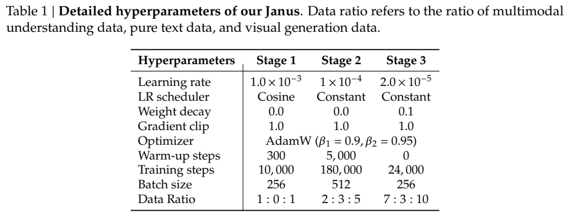
**Table 1 | Janus의 세부 하이퍼파라미터.**

### 4.2. 데이터 설정 (Data Setup)
**1단계.** 다중모달 이해를 위해 ShareGPT4V의 이미지-텍스트 쌍 캡션과 시각 생성을 위해 ImageNet-1k의 샘플이 포함된 데이터셋을 사용합니다.
**2단계.** 데이터를 텍스트 전용 데이터, 교차 이미지-텍스트 데이터, 이미지 캡션 데이터, 표 및 차트 데이터, 시각 생성 데이터 범주로 구성합니다. ImageNet 샘플은 처음 120K 훈련 단계에서만 제공되며 다른 데이터셋의 이미지는 후반 60K 단계에 나타납니다.
**3단계.** 지시 조정 데이터를 사용하여 대화 형식으로 모델을 훈련합니다. 텍스트, 다중모달 이해, 시각 생성 데이터의 혼합을 사용합니다.

### 4.3. 평가 설정 (Evaluation Setup)
**다중모달 이해.** 다중모달 이해 능력을 평가하기 위해 VQAv2, GQA, POPE, MME, SEED, MMB, MM-Vet, MMMU 등 널리 인정받는 벤치마크를 활용합니다.
**시각 생성.** 시각 생성 능력을 평가하기 위해 MSCOCO-30K, MJHQ-30K 및 GenEval 벤치마크를 사용합니다.

### 4.4. 최신 기술과의 비교 (Comparison with State-of-the-arts)

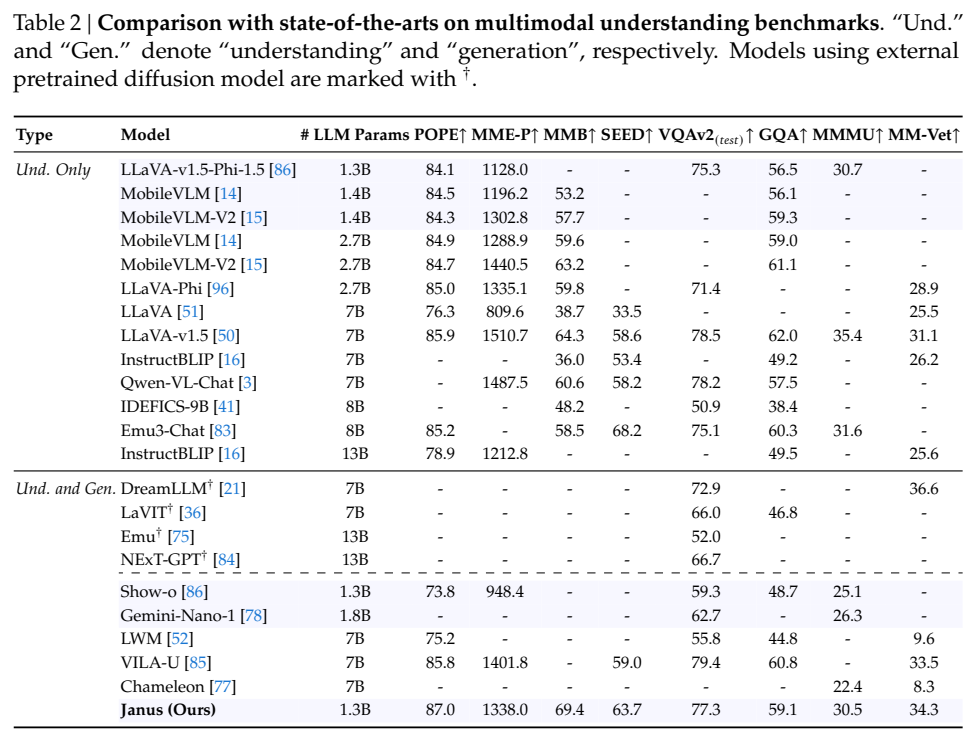
**Table 2 | 다중모달 이해 벤치마크에서의 최신 기술과의 비교.**

**다중모달 이해 성능.** Table 2에서 알 수 있듯 Janus는 유사한 규모의 모델 중 전반적으로 최고의 결과를 달성합니다. 이전 최고의 통합 모델인 Show-o에 비해 MME 및 GQA 데이터셋에서 크게 성능을 향상시켰습니다. 또한 크기가 훨씬 큰 모델과 비교할 때도 경쟁력이 매우 뛰어나며, LLaVA-v1.5 (7B)를 여러 데이터셋에서 능가합니다.

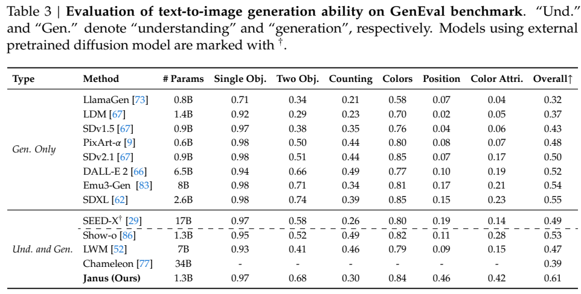
**Table 3 | GenEval 벤치마크에서 텍스트-이미지 생성 능력 평가.**

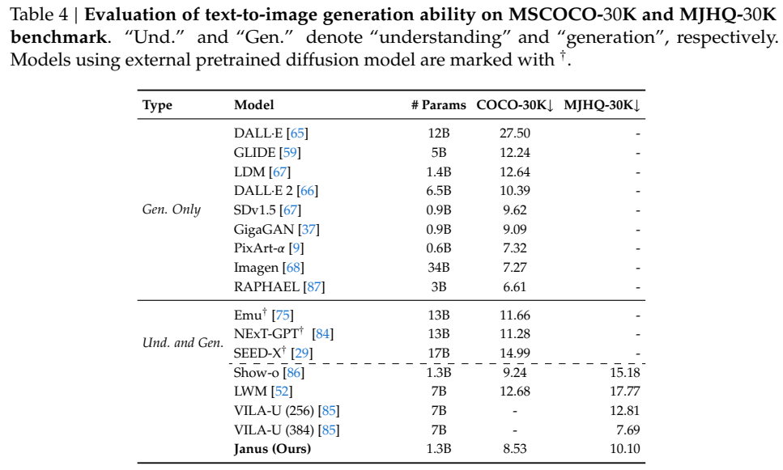
**Table 4 | MSCOCO-30K 및 MJHQ-30K 벤치마크에서 텍스트-이미지 생성 능력 평가.**

**시각 생성 성능.** Table 3에 나타난 바와 같이 Janus는 GenEval에서 61%의 전체 정확도를 달성하여 Show-o와 SDXL, DALL-E 2를 능가합니다. Table 4에서 Janus는 COCO-30K 및 MJHQ-30K 벤치마크에서 각각 우수한 생성 품질을 보여주며, 기존의 생성 전용 모델과도 경쟁력 있는 성능을 달성합니다.

### 4.5. 절제 연구 (Ablation Studies)

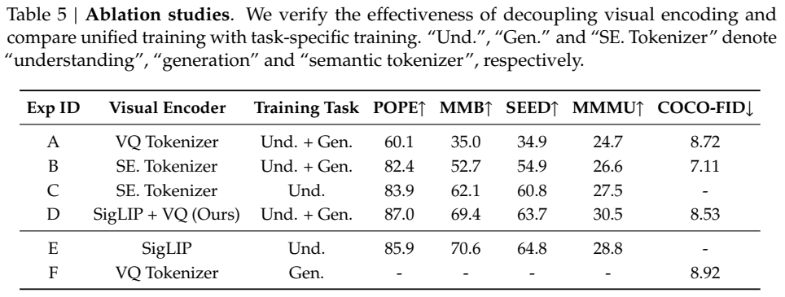
**Table 5 | 절제 연구 (Ablation studies).** 시각적 인코딩 분리의 효율성을 검증하고 통합 학습과 작업별 학습을 비교합니다.

우리는 Janus의 설계 개념의 효과성을 검증하기 위해 절제 연구를 수행합니다. 
**시각적 인코딩 분리의 영향.** 단일 시각 인코더 사용이 다중모달 이해와 생성 사이에서 타협을 유발한다는 점을 확인했습니다. 동일한 인코더로 순수 다중모달 이해 훈련에 중점을 두었을 때 성능 향상이 컸으며, 이는 기존 방법이 이해 능력을 희생했음을 의미합니다. 우리의 접근 방식은 이를 분리함으로써 이러한 상충 관계를 완화했습니다.
**통합 모델 대 순수 이해 및 순수 생성.** 통합 훈련의 성능을 순수 이해 및 순수 생성 훈련과 비교합니다. 실험 결과 통합 훈련의 성능은 두 분야 모두에서 개별 학습 모델과 대등하거나 그 이상의 성능을 보였으며, 다중모달 이해 능력을 거의 손상시키지 않고 강력한 생성 기능을 성공적으로 통합할 수 있음을 증명했습니다.

### 4.6. 정성적 결과 (Qualitative Results)

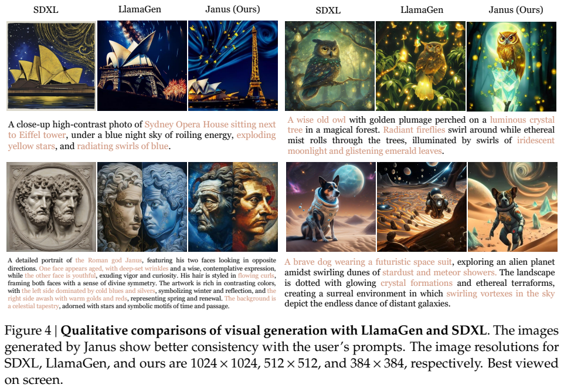
**Figure 4 | LlamaGen 및 SDXL과의 시각 생성의 정성적 비교.**

**시각 생성의 시각화.** Figure 4는 우리 모델과 확산 모델(SDXL) 및 LlamaGen 간의 시각 생성 결과를 비교합니다. 모델이 시각 생성에서 우수한 지시 따르기 능력을 보여주며, 사용자 프롬프트의 세부 사항을 일관성 있게 정확히 캡처함을 알 수 있습니다.

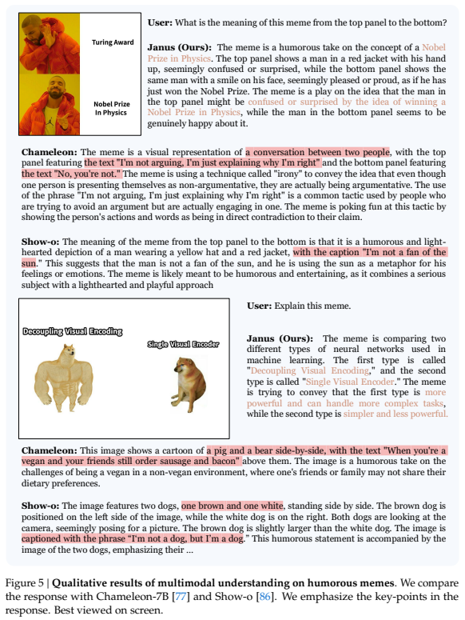
**Figure 5 | 유머러스한 밈(MEME)에 대한 다중모달 이해의 정성적 결과.**

**MEME 이미지에 대한 다중모달 이해.** Figure 5는 Chameleon 및 Show-o와 비교하여 밈을 이해하는 Janus의 능력을 보여줍니다. 텍스트 캡션을 정확히 해석하고 이미지 안에 담긴 유머 감각과 감정을 완벽히 포착합니다. 분리된 시각 인코더는 이전 방식보다 미세한 다중모달 이해 능력에서 확고한 이점을 제공합니다.

## 5. 결론 (Conclusion)
이 논문에서는 단순하고 통합되며 확장 가능한 다중모달 이해 및 생성 프레임워크인 Janus를 소개했습니다. Janus의 핵심 아이디어는 다중모달 이해 및 생성을 위한 시각적 인코딩을 분리하는 것으로, 이는 시각 인코더에 요구되는 다양한 요구에서 발생하는 충돌을 완화합니다. 광범위한 실험을 통해 Janus의 효과와 선도적인 성능을 입증했습니다. 이 모델은 유연하고 확장하기 쉽다는 점에 주목해야 하며, 더 많은 모달리티를 통합하도록 쉽게 확장될 수 있습니다. 차세대 다중모달 범용 모델의 발전에 큰 영감을 줄 것으로 기대합니다.

---

## 부록 (Appendix)

### A. 절제 연구에서 언급된 의미 토크나이저 세부 정보

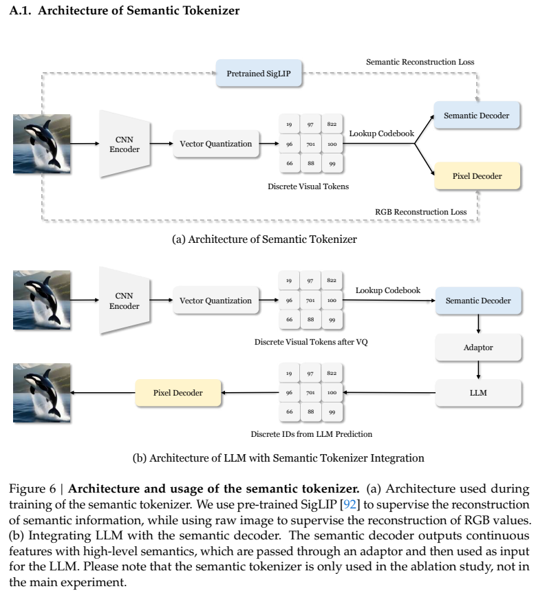
**Figure 6 | 의미 토크나이저의 아키텍처 및 사용.**

의미 토크나이저는 다운샘플 비율 16인 기존의 아키텍처를 기반으로 구축되었습니다. 훈련 절차와 손실 함수는 SigLIP 모델을 통해 의미 특징 복원을 감독하도록 고안되었으며, LLM과의 통합 시 이를 거쳐 이산 ID 예측 값을 생성합니다.

### B. 추가적인 정성적 결과

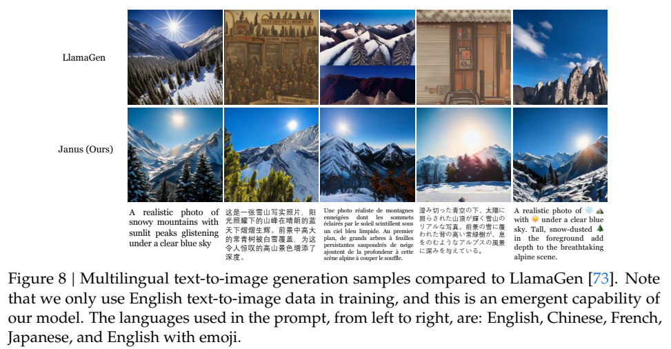
**Figure 8 | LlamaGen과 비교한 다국어 텍스트-이미지 생성 샘플.** 영어 외에도 중국어, 프랑스어, 일본어 프롬프트에서도 지시를 잘 따르며, 이는 오직 영어 텍스트-이미지 데이터로 훈련되었음에도 불구하고 대형 언어 모델의 특성에서 비롯된 놀라운 창발적 능력(emergent capability)입니다.

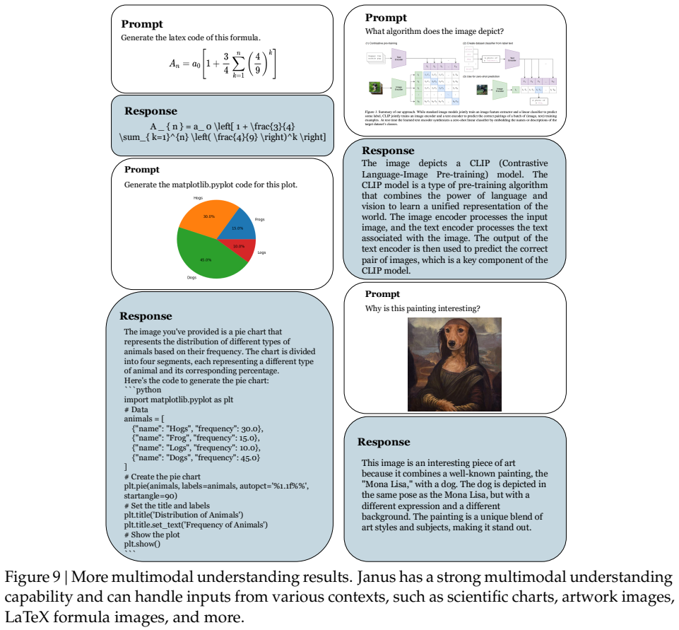
**Figure 9 | 추가 다중모달 이해 결과.** 과학적 차트, 미술 작품, 수학적 수식(LaTeX) 등 다양하고 복잡한 상황의 입력을 완벽하게 처리하는 뛰어난 다중모달 이해 능력을 자랑합니다.